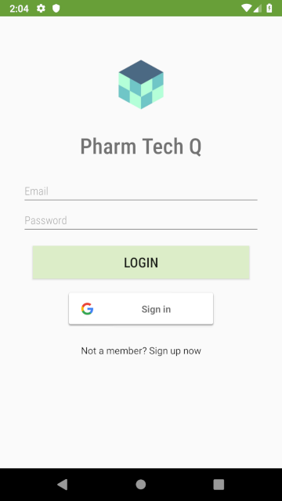
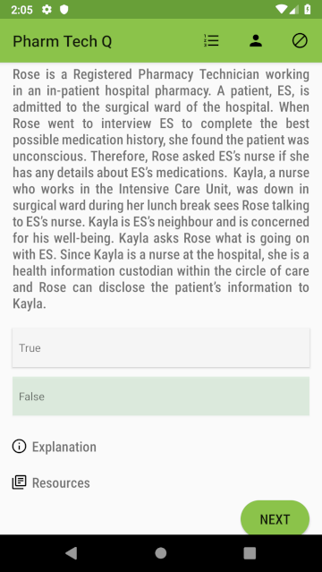
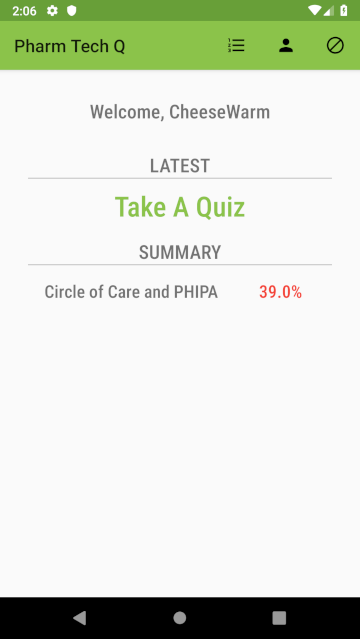
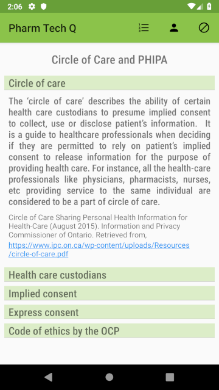

# PharmTechQ

An application to help pharmacy tech students study for their certification

<h2>Application Features</h2>
<ul>
  <li>Registration/Login pages with validation and authentication</li>
  <li>Ability to add new topics and questions efficiently</li>
  <li>Easy to use quiz interface which instantaneously informs the user if there chosen answer was correct or incorrect</li>
  <li>Available options to read detailed explanations or obtain further learning resources on each question so you understand why you got a question wrong, as soon as you get it wrong, to help correct mistakes</li>
  <li>A progress bar to give an estimation to the amount of questions left during the quiz</li>
  <li>A learning hub with extra information about each topic</li>
  <li>A profile page, which tracks the latest quiz topic result and the average results for each quiz topic taken previosuly</li>
  </ul>
  
  
  
  
  
  
  
  <h3>Updates v1.2</h3>
  <ul>
    <li>Fixed bug in Learning Hub where headings had to be clicked twice to show contents</li>
    <li>Adjusted Learning Hub headings so they would fit on one line for smaller divices</li>
    <li>Normalized buttons, justified content text and increased margins to 16dp in Learning Hub to match other activities</li>
    <li>Fixed login and register activity views getting cut off on smaller screens</li>
     <li>Changed to NestedScrollView to improve nested recyclerviews performance</li>
     <li>Took APA references and seperated them into reference description and reference link, if available, using a regex to make the link clickable so users can access the reference material in a browser</li>
     <li>Added Google Sign-In capability</li>
  </ul>
  <h3>Technology</h3>
  <ul>
    <li>Java 8</li>
    <li>Android 4.4 (KitKat)</li>
    <li>Firebase Realtime Database</li>
  </ul>
